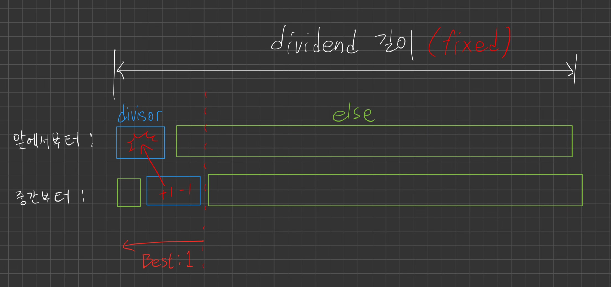

https://www.acmicpc.net/problem/1543

## 문제

세준이는 영어로만 이루어진 어떤 문서를 검색하는 함수를 만들려고 한다. 이 함수는 어떤 단어가 총 몇 번 등장하는지 세려고 한다. 그러나, 세준이의 함수는 중복되어 세는 것은 빼고 세야 한다. 예를 들어, 문서가 abababa이고, 그리고 찾으려는 단어가 ababa라면, 세준이의 이 함수는 이 단어를 0번부터 찾을 수 있고, 2번부터도 찾을 수 있다. 그러나 동시에 셀 수는 없다.

세준이는 문서와 검색하려는 단어가 주어졌을 때, 그 단어가 최대 몇 번 중복되지 않게 등장하는지 구하는 프로그램을 작성하시오.

## 입력

첫째 줄에 문서가 주어진다. 문서의 길이는 최대 2500이다. 둘째 줄에 검색하고 싶은 단어가 주어진다. 이 길이는 최대 50이다. 문서와 단어는 알파벳 소문자와 공백으로 이루어져 있다.

## 예제 입력 1 

```
ababababa
aba
```

## 예제 출력 1 

```
2
```

## 예제 입력 2 

```
a a a a a
a a
```

## 예제 출력 2 

```
2
```


## 풀이

그리디 알고리즘으로 풀리는 문제다.

입력 첫째 줄은 dividend, 둘째 줄을 divisor라고 하자.

이 문제에서 divisor는 쪼개질 수 없다는 특성을 가지고 있다. 왜냐하면 문제에서는 항상 dividend로부터 '온전히 완성된 divisor 단위의 덩어리'의 갯수만 세고 있기 때문이다.

때문에 다음과 같이 생각할 수 있다.



배경

- divisor가 쪼개질 수 없다는 특성을 가진다.
- 앞에서부터 세는 것과 중간부터 세는 것 두가지 방법이 있다.

두 방법을 비교했을 때, 두번째 방법에서 갯수 하나를 얻을 때마다 첫번째 방법에서 얻은 갯수를 하나를 반드시 침해하게 된다. 만약 침해하지 않았다면, 센 divisor가 첫번째 방법에서도 else 영역 안에 있었던 것이므로 어차피 첫번째 방법으로 셀 수 있었던 것이다.

따라서 항상 앞에서부터 세는 것이 최선의 방법이라는 보장을 받게 된다. 이 방법을 적용하여 코드를 짜면 다음과 같다.


## 코드

```java
public class p1543 {
    public static void main(String[] args) throws Exception {
        BufferedReader br = new BufferedReader(new InputStreamReader(System.in));
        BufferedWriter bw = new BufferedWriter(new OutputStreamWriter(System.out));
        String dividend = br.readLine();
        String divisor = br.readLine();
        String target = "";
        int answer = 0;

        for (int i = 0; i < dividend.length(); i++) {
            target += dividend.charAt(i);
            if (target.equals(divisor)) {
                answer += 1;
                target = "";
            }
            if (target.length() >= divisor.length()) {
                target = target.substring(1);
            }
        }

        bw.write(Integer.toString(answer));
        bw.flush();

    }
}
```


