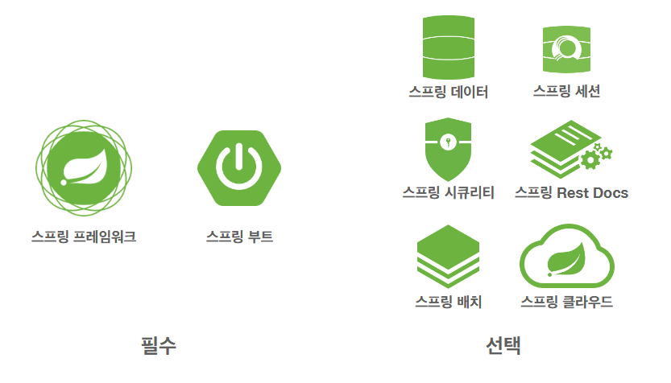
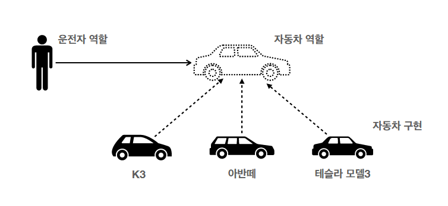
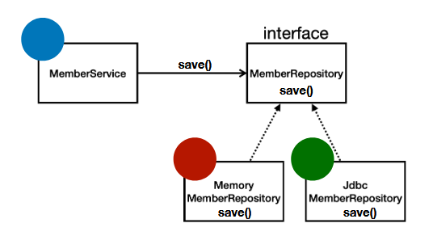

## 스프링 탄생

스프링 이전엔 EJB라는 걸 널리 사용했음. 근데 이게 더럽게 어려운데 더럽게 느리고 하여튼 구데기였음. 이때를 자바진영의 winter라고 했음.

이 EJB에 불만이 많았던 한 개발자(로드 존슨)가 스프링을 만들었고, 이름이 spring인 이유도 이전까지가 winter였기 때문임.

위 그림은 스프링 내에 포함된 스프링 기능들임. 스프링 프레임워크는 당연히 기본이고, 스프링 부트 역시 2014년에 나왔지만 현재 모든 실무에서 필수적인 요소가 됐음.

## 스프링 부트?

톰캣같은 웹서버를 내장해서 별도 웹 서버의 설치가 불필요함.

예전엔 스프링 쓸때 라이브러리 땡겨올게 너무 많았는데 이걸 한번에 자동으로 구성해줌. 그리고 스프링 버전마다 어떤 라이브러리는 맞고 어떤건 안맞고 까탈스러웠는데 스프링 부트에서 이걸 자체적으로 테스트하고 매니지해줌.

예전엔 스프링 설정이 너무 어려웠는데 스프링 부트에서는 웬만한게 디폴트설정 되어있고 커스텀할 수 있음.

스프링부트는 혼자서 돌아갈 수 없음. 스프링 프레임워크랑 같이 쓰인다는 전제 하에 있는 부가기능들임.

## 스프링 단어?

스프링이라는 단어는 문맥에 따라 다르게 사용되는 애매한 단어다.

- 스프링 DI 컨테이너 기술
- 스프링 프레임워크
- 스프링 부트, 스프링 프레임워크 등을 모두 포함한 스프링 생태계

## 스프링을 왜 만들었나?

스프링은 자바 기반의 프레임워크임. 그리고 자바는 태생 자체가 객체 지향을 최대한 지향하기 위한 성격을 가짐.

근데 EJB를 쓸 때, 모든 코드가 EJB에 종속적이고 이를 고려하며 구성돼야 했기에 객체 지향의 장점을 필연적으로 다 말아먹음.

스프링은 결국 **좋은 객체 지향**을 할 수 있게 도와주기 위한 프레임워크임.

## 객체 지향 프로그래밍

하나의 프로그램을 "객체"의 모임으로 파악하고자 하는것. 각 객체는 메세지를 주고받고 데이터를 처리하고 등등 협력을 할 수 있다.

객체 지향을 하면 프로그램이 유연하고 변경이 용이해지기 때문에 대규모 sw 개발에 많이 쓰인다.

## 다형성

다형성을 실세계의 역할과 구현에 빗대어 묘사할 수 있다.

위 그림에서 자동차라는 역할은 여러가지 방식으로 구현될 수 있음. 그게 되는 근본적인 이유는 구현체들이 모두 '자동차'라는 역할을 기본으로 구현됐기 때문임. 그로써 서로간의 호환이 가능함. 이걸 보고 다형성을 가졌다고 함.

가장 큰 메리트는, 자동차가 K3에서 테슬라로 바뀌어도, 내연차에서 전기차로 바뀌어도 클라이언트는 운전면허를 새로 딸 필요가 없다는 것. 즉, 클라이언트에게 뭔가를 강요하지 않아도 된다는 것.

### 핵심

- **클라이언트**는 대상의 **역할(인터페이스)**만 알면 된다.
- **클라이언트**는 구현 대상의 내부 구조를 몰라도 된다.
- **클라이언트**는 구현 대상의 내부 구조가 변경되어도 영향을 받지 않는다.
- **클라이언트**는 구현 대상 자체를 변경해도 영향을 받지 않는다.

객체 지향의 **핵심은 결국 클라이언트와의 관계**다. 무언가를 주고받기에, **서로 속살은 궁금하지도 않고 필요한것만 주고받고 싶기에 객체 지향이 필요한 것.**

### 자바에서의 다형성

자바는 다형성을 어떻게 구현했나? -> 인터페이스, 오버라이딩

### 다형성의 본질

인터페이스의 구현체 인스턴스를 실행 시점에 유연하게 변경할 수 있음.

ㄴ **클라이언트를 변경하지 않고, 서버의 구현 기능을 유연하게 변경할 수 있음.**

### 한계

인터페이스가 변하면? 클라, 서버 모두 큰 변경이 발생해버림.

**인터페이스를 시작부터 잘 설계하는게 매우 중요**

## 스프링과 객체 지향

**다형성이 가장 중요하다.**

스프링은 다형성을 극대화해서 이용할 수 있게 도와준다.

**스프링에서 얘기하는 제어의 역전(IoC), 의존관계 주입(DI)은 다형성을 활용해서 역할과 구현을 편리하게 다룰 수 있도록 지원함.**

스프링을 쓰면 레고 블럭 조립하는 것 마냥 구현을 편리하게 변경할 수 있다.

## 객체 지향 설계의 5원칙(SOLID)

클린코드로 유명한 로버트 마틴이 좋은 객체 지향 설계의 5원칙을 정의함. SOLID는 앞글자 딴거임.

1. ### SRP 단일 책임 원칙

   - **한 클래스는 하나의 책임만 가져야 한다.**
   - 하나의 책임이라는 것은 모호하다.
     - 클 수도, 작을 수도 있다.
     - 문맥과 상황에 따라 다르다.
   - 중요한 기준은 변경이다. 변경이 있을 때 파급 효과가 적으면 이 원칙을 잘 따른 것.
   - 예)  UI변경, 객체의 생성과 사용을 분리

2. ### **OCP 개방-폐쇄 원칙**

   - **코드가 확장에는 열려있으나 변경에는 닫혀있어야 한다.**
     - 새로운 구현을 얼마든지 할 수는 있어도, 기존의 것을 수정하는 것을 피해야 함. 그러면 필연적으로 파급 효과가 생길 가능성이 증가하니까.
     - **문제점**
       - MemberRepository m = new MemoryMemberRepository(); //기존 코드
       - MemberRepository m = new JdbcMemberRepository(); //변경 코드
       - 이런 경우는 어떡함? 구현 객체를 변경하려면 클라이언트 코드를 변경할 수밖에 없는데.
       - 분명 다형성을 사용했지만 OCP 원칙을 깰 수밖에 없음
       - **해결: 객체를 생성하고, 연관관계를 맺어주는 별도의 조립, 설정자가 필요함. (스프링 컨테이너)**

3. ### LSP 리스코프 지환 원칙

   - 다형성에서 하위 클래스는 인터페이스의 규약을 다 지켜야 한다. 비단 컴파일이 안되고 하는 문제가 아니라, 인터페이스의 의미적 요소까지도 틀림 없이 상속해야 한다.
   - 예) 자동차 엑셀은 가속을 시키는 역할이어야지 브레이크가 되어선 안됨.

4. ### ISP 인터페이스 분리 원칙

   - **자동차**라는 인터페이스를 **운전, 정비** 인터페이스로 분리
   - 이렇게 하면 정비 인터페이스가 바뀔 때 클라이언트에 영향을 안 줄 수 있음.
   - 인터페이스가 명확해지고 대체 가능성이 높아짐.

5. ### **DIP 의존관계 역전 원칙**

   - "프로그래머는 추상화에 의존해야지, 구체화에 의존하면 안된다."
   - 클라이언트가 구현체에 의존하지 않고, 인터페이스에 의존하게 하라는 뜻.

## 다형성의 한계

- 객체 지향의 핵심은 **다형성**
- 그러나 **다형성만으로는 OCP, DIP를 지킬 수 없음.**
- 뭔가 더 필요함.(스프링)

## 스프링의 의의

스프링은 DI 컨테이너를 제공함으로써(DI: 의존관계, 의존성 주입) OCP, DIP를 만족하게 해주고, 클라이언트 코드의 변경 없이 기능을 확장할 수 있게 해준다.

 쉽게 부품 교체하듯이 개발을 할 수 있게 해준다.

스프링이 없었을 때, 자바 코드, EJB만으로 OCP, DIP 원칙을 지키며 개발을 하려 했던 이들이 있다. 근데 해보니까 배보다 배꼽이 더 컸다. 그래서 만들어진 게 스프링이다.

## 인터페이스에 대해

이상적으로는 모든 설계에 인터페이스를 부여하는 게 좋다.

근데 그렇다고 무분별하게 인터페이스를 도입하면, **추상화라는 비용이 발생한다.**

런타임에서 코드가 대상 인터페이스를 한번 거친 뒤에 구현 클래스를 열어보게 되므로, 이게 비용이 된다.

기능을 확장할 가능성이 없다면 구체 클래스를 바로 쓰고, 향후 꼭 필요할 때 리팩토링 해서 인터페이스를 도입하는 것도 방법임. 이건 사람마다 다른 실무 고민의 영역.

