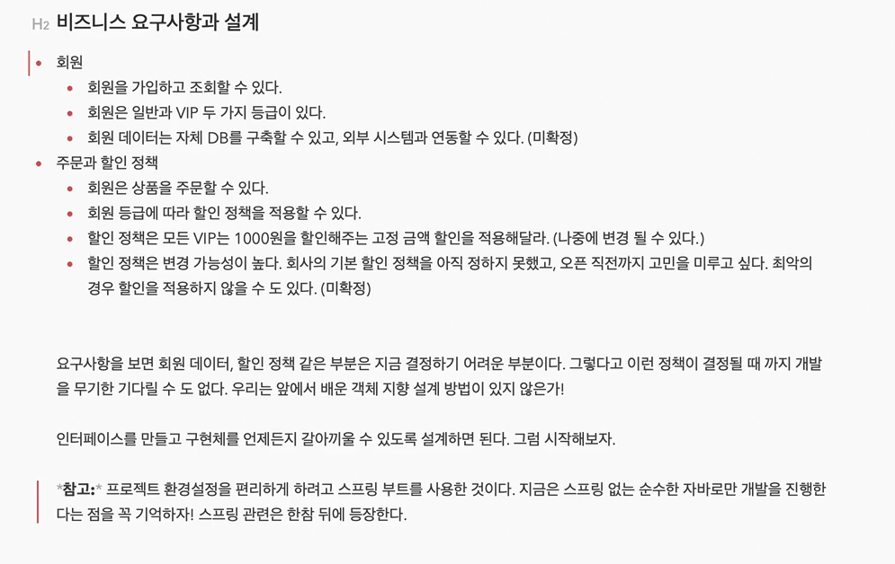

ㅇ


이번 예제에서는 스프링 없이 순수 자바 코드로 짤 거지만, 편의를 위해 생성은 스프링으로 한다. 별다른 기능이 필요 없기에 디펜던시에는 아무것도 추가 안한다.


이렇게 빌드랑 런, 테스트에 모두 인텔리제이를 쓰게 해야 속도가 빠르고 좋아진다.




구현해야 할 비즈니스 요구사항이다.


## 회원 도메인 설계

- 회원을 `가입`하고 `조회`할 수 있다.
- 회원은 `일반`과 `VIP` 두 가지 등급이 있다.
- 회원 데이터는 자체 DB를 구축할 수도, 외부 시스템과 연동할 수도 있다.(미정)


`가입`과 `조회` 두 서비스가 들어간다.

특히, 변경될 수도 있는 부분에 인터페이스를 도입하여 다형성을 갖춘 게 포인트로 보인다.

개발 시점에는 `메모리 회원 저장소`로 임시 리포지토리를 만들어 개발을 진행한다.


더 자세히 하면 이렇다. 서비스 역시도 지금 당장은 다형성이 필요 없을지라도 인터페이스로 한번 거치는 모습이다.


위 클래스 다이어그램의 클래스로부터 생성된 인스턴스 사이의 다이어그램이다.

즉, 클라이언트 입장에서 실제로 사용하게 되는 프로그램의 모습이라고 할 수 있을 듯하다.


위와 같이 이렇게 총 3개의 그림이 자주 쓰인다.

- 도메인 협력 관계
- 클래스 다이어그램
- 객체 다이어그램


## 회원 도메인 구현

`Grade.java`

```java
public enum Grade {
    BASIC,
    VIP
}
```


`Member.java`

```java
public class Member {
    private Long id;
    private String name;
    private Grade grade;

    public Member(Long id, String name, Grade grade) {
        this.id = id;
        this.name = name;
        this.grade = grade;
    }

    public Long getId() {
        return id;
    }

    public void setId(Long id) {
        this.id = id;
    }

    public String getName() {
        return name;
    }

    public void setName(String name) {
        this.name = name;
    }

    public Grade getGrade() {
        return grade;
    }

    public void setGrade(Grade grade) {
        this.grade = grade;
    }
}
```


`MemberRepository.java`

```java
public interface MemberRepository {
    void save(Member member);
    
    Member findById(Long memberId);
}
```


`MemoryMemberRepository.java`

```java
public class MemoryMemberRepository implements MemberRepository{

    private static Map<Long, Member> store = new HashMap<>();
    @Override
    public void save(Member member) {
        store.put(member.getId(), member);
    }

    @Override
    public Member findById(Long memberId) {

    }
}
```

예제이므로 오류 처리같은거 없이 간단히 구현함.


`MemberService.java`

```java
public interface MemberService {
    void join(Member member);
    
    Member findMember(Long memberId);
}
```


`MemberServiceImpl.java`

```java
public class MemberServiceImpl implements MemberService{
    private final MemberRepository memberRepository = new MemoryMemberRepository();

    @Override
    public void join(Member member) {
        memberRepository.save(member);
    }

    @Override
    public Member findMember(Long memberId) {
        return memberRepository.findById(memberId);
    }
}
```


## 테스트

`MemberApp.java`

```java
public class MemberApp {
    public static void main(String[] args) {
        MemberService memberService = new MemberServiceImpl();
        Member member = new Member(1L, "memberA", Grade.VIP);
        memberService.join(member);

        Member findMember = memberService.findMember(1L);
        System.out.println("new member = " + member.getName());
        System.out.println("find Member = " + findMember.getName());
    }
}
```

프레임워크 하나도 안쓴 순수 자바 코드. 절대 좋은 방법이 아니다.


`MemberServiceTest.java`

```java
class MemberServiceTest {

    MemberService memberService = new MemberServiceImpl();
    @Test
    void join() {
        //given
        Member member = new Member(1L, "memberA", Grade.VIP);

        //when
        memberService.join(member);
        Member findMember = memberService.findMember(1L);

        //then
        Assertions.assertThat(member).isEqualTo(findMember);

    }
}
```

JUnit 프레임워크를 사용한 테스트 코드다.


### 문제점

위 도메인과 테스트들은 모두 OCP, DIP를 만족하지 않는다. 

인터페이스를 받아 처리하는 방식으로 다형성을 이용한다고 해도, 결국 코드 안에서 "new ~~"로 구현체들의 이름을 언급하여 인스턴스를 생성할 수밖에 없다.


## 주문과 할인 도메인 설계


