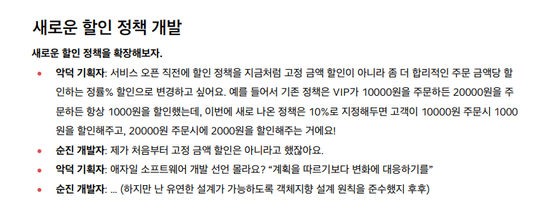
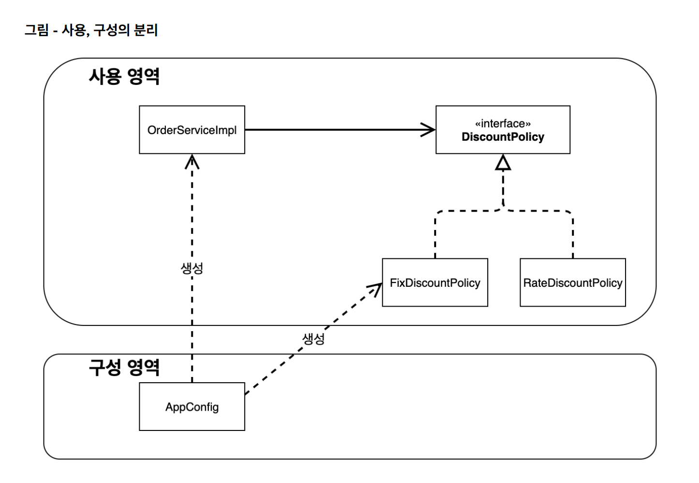

## 새로운 요구사항



위와 같은 상황이 주어진다. 기획자 말대로 변화에 대응할 수 있어야 한다.

우선 새로 요구된 정률 할인 정책을 다음과 같이 구현한다.


## 구현

`RateDiscountPolicy.java`

```java
public class RateDiscountPolicy implements DiscountPolicy{
    private int discountPercent = 10;

    @Override
    public int discount(Member member, int price) {
        if (member.getGrade() == Grade.VIP) {
            return price * discountPercent / 100;
        } else {
            return 0;
        }
    }
}
```

테스트코드도 다음과 같이 짠다.

`RateDiscountPolicyTest.java`

```java
class RateDiscountPolicyTest {
    RateDiscountPolicy discountPolicy = new RateDiscountPolicy();

    @Test
    @DisplayName("VIP는 10% 할인이 적용되어야 한다")
    void vip_o() {
        // given
        Member member = new Member(1L, "memberVIP", Grade.VIP);
        String memberName = "memberVIP";
        int price = 10000;
        // when
        int discount = discountPolicy.discount(member, price);
        // then
        Assertions.assertThat(discount).isEqualTo(1000);
    }

    @Test
    @DisplayName("VIP가 아니면 할인이 적용되지 않아야 한다")
    void vip_x() {
        // given
        Member member = new Member(2L, "memberBASIC", Grade.BASIC);
        String memberName = "memberBASIC";
        int price = 10000;
        // when
        int discount = discountPolicy.discount(member, price);
        // then
        Assertions.assertThat(discount).isEqualTo(0);
    }
}
```


## 문제점 - DIP, OCP 위반


역할과 구현을 충분히 구분하고, 다형성과 인터페이스를 잘 활용했지만 **여전히 클라이언트의 코드 수정을 거쳐야 함을 해결하지 못했다**.


클라이언트가 인터페이스가 아닌 구현체에 의존하고 있었음을 위와 같이 그림으로 표현할 수 있다. 저 구현체와의 관계를 완전히 끊을 수 있어야 한다.


## 해결법

그러면 클라이언트가 구현체에 의존하지 않고 진짜 인터페이스에만 의존하게 하면 된다.

근데 그러면 해당 인터페이스 역할을 할 구현체가 어느 구현체인지는 누가 지정해주나?

이걸 대신 누군가가 정해서 인터페이스를 사용하는 곳마다 그 구현체를 **주입**해 줄 필요가 있다.

이 역할을 해주는 AppConfig 클래스를 만들어 줄 수 있다. 이 클래스는 **구현 객체 생성**과 **연결**을 담당한다.


## AppConfig 구현

```java
public class AppConfig {
    public MemberService memberService() {
        return new MemberServiceImpl(new MemoryMemberRepository());
    }

    public OrderService orderService() {
        return new OrderServiceImpl(new MemoryMemberRepository(), new FixDiscountPolicy());
    }

}
```

위와 같이 의존성 주입을 해주는 클래스, AppConfig를 만들어 준다.

그리고 아래와 같이 영향을 받는 클래스들의 생성자를 수정한다.

```java
public class MemberServiceImpl implements MemberService{
    private final MemberRepository memberRepository;

    public MemberServiceImpl(MemberRepository memberRepository) {
        this.memberRepository = memberRepository;
    }
...
```

```java
public class OrderServiceImpl implements OrderService {
    private final MemberRepository memberRepository;
    private final DiscountPolicy discountPolicy;

    public OrderServiceImpl(MemberRepository memberRepository, DiscountPolicy discountPolicy) {
        this.memberRepository = memberRepository;
        this.discountPolicy = discountPolicy;
    }
...
```

이렇게 생성자를 통해 각 클래스들은 구현체가 무엇인지 알 필요도 없이 **인터페이스에만 의존**할 수 있게 된다.

인터페이스로 잡아놓은 자리에 **어떤 구현체를 넣을 지는** 외부에 있는 **AppConfig의 책임**이다.


이렇게 굳이 복잡하게 그릴 수도 있다.


좀 더 자세히 하자면, AppConfig는 생성한 구현체의 참조값을 생성자에 전달한다. 


## AppConfig 리팩토링


설정 정보는 일종의 구성 정보다. 현재 AppConfig를 봐서는 한번에 프로그램 전체 구성에 대한 느낌을 잡을 수가 없다.

기존 `AppConfig.java`

```java
public class AppConfig {
    public MemberService memberService() {
        return new MemberServiceImpl(new MemoryMemberRepository());
    }

    public OrderService orderService() {
        return new OrderServiceImpl(new MemoryMemberRepository(), new FixDiscountPolicy());
    }

}
```

수정 `AppConfig.java`

```java
public class AppConfig {
    public MemberService memberService() {
        return new MemberServiceImpl(memberRepository());
    }

    private MemberRepository memberRepository() {
        return new MemoryMemberRepository();
    }

    public OrderService orderService() {
        return new OrderServiceImpl(memberRepository(), discountPolicy());
    }

    public DiscountPolicy discountPolicy() {
        return new FixDiscountPolicy();
    }

}
```

이렇게 수정하면 구현된 클래스들이 어떻게 구성되는지 모두 볼 수 있다.

그리고 MemberRepository의 구현체가 다른 것으로 대체된다고 하면 memberRepository() 부분만 수정하면 된다.


## 정률 할인 정책으로 변경&적용



지금까지의 리팩토링을 거쳐서, 위와 같은 그림의 구성이 완성되었다.

이젠 할인 정책을 정액에서 정률로 변경하고 싶더라도 AppConfig만 만져줌으로써 이룰 수 있다.

```java
//    public DiscountPolicy discountPolicy() {
//        return new FixDiscountPolicy();
//    }
    public DiscountPolicy discountPolicy() {
        return new RateDiscountPolicy();
    }
```

AppConfig 내에서 할인 정책의 구현체로 뭘 쓸지 한줄만 수정했다.

이걸로 그냥 끝났다. 이렇게 쉬워진다.


## 관련된 객체 지향 원칙

지금까지의 수정은 DIP와 OCP를 지키기 위한 과정이었다. 아래에 이에 대한 설명이 있다.


DIP는 구현체 말고 인터페이스에 의존하라는 간단한 얘기.

OCP는 간단히 설명해서 할인 정책 클래스와 같은 코드들을 하나도 수정하지 않아도 되도록, AppConfig라는 코드를 확장해 붙였다는 얘기다. 이게 확장엔 열리고 변경엔 닫혀야 한다는 맥락의 얘기다.


## IoC(제어의 역전)

기존 프로그램은 클라이언트 구현 객체가 스스로 필요한 서버 구현 객체를 생성하고, 연결하고, 실행했다. 한마디 로 구현 객체가 프로그램의 제어 흐름을 스스로 조종했다. 개발자 입장에서는 자연스러운 흐름이다.

근데 우리가 AppConfig를 추가함으로써 더이상 프로그램의 제어 흐름이 구현체에 있지 않게 된다. AppConfig가 전체 흐름을 제어한다.

이렇게 프로그램 제어 흐름을 직접 제어하지 않고 외부에서 관리하게 하는 것을 제어의 역전(IoC)라고 한다.

### 프레임워크과 라이브러리 구별법

프레임워크가 내가 작성한 코드를 제어하고, 대신 실행하면 그건 프레임워크가 맞다.

반면 내가 작성한 코드가 직접 제어의 흐름을 담당하면 그건 프레임워크가 아니라 라이브러리다.


## DI(의존관계 주입)

OrderServiceImpl 은 DiscountPolicy 인터페이스에 의존한다. 실제 어떤 구현 객체가 사용될지는 모른다.

의존관계는 **정적인 클래스 의존 관계와, 실행 시점에 결정되는 동적인 객체(인스턴스) 의존 관계** 둘을 분리해서 생각해야 한다. 

### 정적인 클래스 의존관계

- 앱을 실행하지 않고도 분석할 수 있다. import 코드만 보고 판단할 수 있다.

- 어떤 클래스가 무슨 인터페이스나 클래스에 의존하는지는 알 수 있어도, 실제로 어떤 객체가 주입될 지는 앱을 실행하기 전까지 알 수 없다.

### 동적인 객체 인스턴스 의존 관계

- 앱 실행 시점에 실제 생성된 객체 인스턴스의 참조가 연결된 의존 관계다.

앱 실행 시점에 외부에서 실제 구현 객체를 생성하고 클라이언트에 전달해서 클라이언트와 서버의 실제 의존관계가 연결되는 걸 주입이라 한다.

의존관계 주입을 사용하면 **정적인 의존관계는 변경하지 않고 동적인 의존관계만 쉽게 변경**할 수 있게 된다.

AppConfig 처럼 객체를 생성하고 관리하면서 의존관계를 연결해 주는 것을 IoC 컨테이너 또는 **DI 컨테이너**라 한다


## 스프링으로 전환

AppConfig를 다음과 같이 어노테이션을 붙여 수정해준다.

```java
@Configuration
public class AppConfig {
    @Bean
    public MemberService memberService() {
        return new MemberServiceImpl(memberRepository());
    }

    @Bean
    public MemberRepository memberRepository() {
        return new MemoryMemberRepository();
    }

    @Bean
    public OrderService orderService() {
        return new OrderServiceImpl(memberRepository(), discountPolicy());
    }

    @Bean
    public DiscountPolicy discountPolicy() {
        return new RateDiscountPolicy();
    }

}
```

AppConfig가 설정 파일이라고 명시하며, 생성되는 각 구현체들을 Bean으로 만들었다.

그리고 먼저 MemberApp을 다음과 같이 바꿔준다.

```java
public class MemberApp {
    public static void main(String[] args) {
//        AppConfig appConfig = new AppConfig();
//        MemberService memberService = appConfig.memberService();

        ApplicationContext applicationContext = new AnnotationConfigApplicationContext(AppConfig.class);
        MemberService memberService = applicationContext.getBean("memberService", MemberService.class);

        Member member = new Member(1L, "memberA", Grade.VIP);
        memberService.join(member);

        Member findMember = memberService.findMember(1L);
        System.out.println("new member = " + member.getName());
        System.out.println("find Member = " + findMember.getName());
    }
}
```

```java
        ApplicationContext applicationContext = new AnnotationConfigApplicationContext(AppConfig.class);
        MemberService memberService = applicationContext.getBean("memberService", MemberService.class);

```

추가된 부분은 이렇다. 설정 파일을 통해 스프링 컨테이너를 만들고, 컨테이너 내에서 "memberService"(**메소드 이름과 일치**)에 해당하는 빈을 가져오는 코드다.

`ApplicationContext`를 스프링 컨테이너라 한다.

스프링 컨테이너는 `@Configuration`이 붙은 **설정 파일을 하나 받고** 생성된다. 그 후 이 설정 파일 내에 `@Bean`이 붙은 메소드를 **모두 호출하여** 반환된 객체들을 **컨테이너에 등록**해 둔다. 이렇게 등록된 객체들을 **스프링 빈**이라고 한다.
