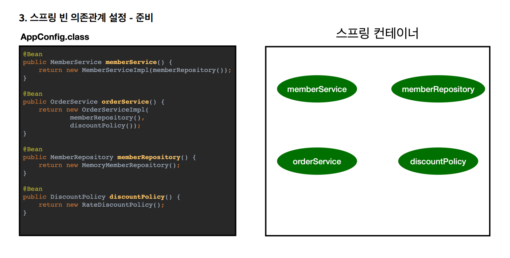
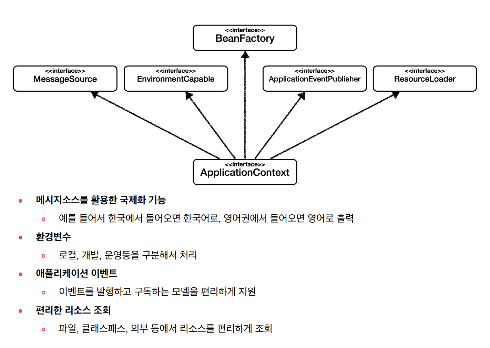
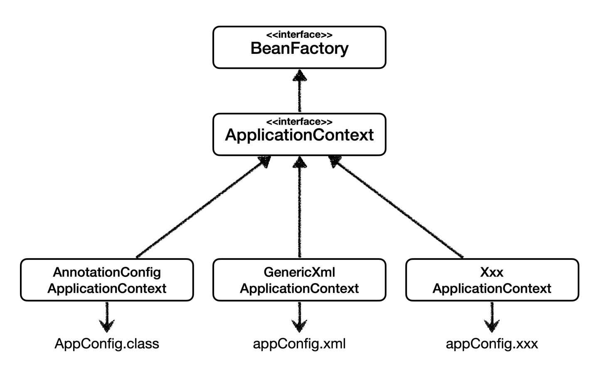

## 스프링 컨테이너 생성

지난 포스트에서 applicationContext(스프링 컨테이너)를 만들어 적용했다.

옛날에는 스프링 컨테이너를 XML기반으로 만들기도 했다. 근데 요샌 잘 안쓰는 방식이고, 대부분 어노테이션 기반의 자바 설정 클래스를 기반으로 만든다.

### 스프링 컨테이너의 생성 과정


딕셔너리처럼 키-밸류 형태로 저장된다.

그리고 빈 이름은 **절대네버** 중복되게 하면 안된다. 이론상 컨트롤 가능하더라도 그냥 원천적으로 그렇게 안하는게 좋다.




여기서 의존관계를 주입한다고 하는 것은, 동적인 의존관계를 주입한다는 얘기다. 실제로 어떤 실재하는 인스턴스를 연결할지 정해진다는거다.

실제로는 이걸로 끝이 아니고, 자동 의존 관계 주입이라는 과정을 또 거친다. 이건 뒤에 배운다.


## 컨테이너에 등록된 모든 빈 조회

테스트 코드를 작성해서 확인해보자.

```java
public class ApplicationContextInfoTest {
    AnnotationConfigApplicationContext ac = new AnnotationConfigApplicationContext(AppConfig.class);
    @Test
    @DisplayName("모든 빈 출력하기")
    void findAllBean() {
        String[] beanDefinitionNames = ac.getBeanDefinitionNames();
        for (String beanDefinitionName : beanDefinitionNames) {
            Object bean = ac.getBean(beanDefinitionName);
            System.out.println("name = " + beanDefinitionName + " object = " + bean);
        }
    }
}
```


실행 결과:

```text
name = org.springframework.context.annotation.internalConfigurationAnnotationProcessor object = org.springframework.context.annotation.ConfigurationClassPostProcessor@a50b09c
name = org.springframework.context.annotation.internalAutowiredAnnotationProcessor object = org.springframework.beans.factory.annotation.AutowiredAnnotationBeanPostProcessor@2e77b8cf
name = org.springframework.context.annotation.internalCommonAnnotationProcessor object = org.springframework.context.annotation.CommonAnnotationBeanPostProcessor@2c4ca0f9
name = org.springframework.context.event.internalEventListenerProcessor object = org.springframework.context.event.EventListenerMethodProcessor@67ef029
name = org.springframework.context.event.internalEventListenerFactory object = org.springframework.context.event.DefaultEventListenerFactory@7df587ef
name = appConfig object = hello.hellospringbasic.AppConfig$$SpringCGLIB$$0@6e57e95e
name = memberService object = hello.hellospringbasic.member.MemberServiceImpl@2755d705
name = memberRepository object = hello.hellospringbasic.member.MemoryMemberRepository@56db847e
name = orderService object = hello.hellospringbasic.order.OrderServiceImpl@740abb5
name = discountPolicy object = hello.hellospringbasic.discount.RateDiscountPolicy@560cbf1a

```

스프링 자체적으로 등록되는 빈과 함께 전부 출력됐다.

밑에서부터 4개가 직접 등록한 빈들이다.

스프링 기본 빈들을 제외하고 내가 등록한 애플리케이션 빈들만 출력하게 할 수도 있다.

```java
    @Test
    @DisplayName("애플리케이션 빈 출력하기")
    void findApplicationBean() {
        String[] beanDefinitionNames = ac.getBeanDefinitionNames();
        for (String beanDefinitionName : beanDefinitionNames) {
            BeanDefinition beanDefinition = ac.getBeanDefinition(beanDefinitionName);
            if (beanDefinition.getRole() == BeanDefinition.ROLE_APPLICATION) {
                Object bean = ac.getBean(beanDefinitionName);
                System.out.println("name = " + beanDefinitionName + " object = " + bean);
            }
        }
    }
```

실행 결과:

```text
name = appConfig object = hello.hellospringbasic.AppConfig$$SpringCGLIB$$0@7df587ef
name = memberService object = hello.hellospringbasic.member.MemberServiceImpl@3591009c
name = memberRepository object = hello.hellospringbasic.member.MemoryMemberRepository@5398edd0
name = orderService object = hello.hellospringbasic.order.OrderServiceImpl@b5cc23a
name = discountPolicy object = hello.hellospringbasic.discount.RateDiscountPolicy@5cc5b667
```

appConfig를 포함하여 5개의 bean이 출력됐다.


## 스프링 빈 조회 - 기본

이번엔 원하는거 하나씩 조회하는 가장 기본적인 방법이다.

`ac.getBean("이름", {타입})`

`ac.getBean("이름")`

`ac.getBean({타입})`

위와 같이 `getBean`을 쓰는게 가장 기본적이다.

```java
import static org.assertj.core.api.Assertions.*;
import static org.junit.jupiter.api.Assertions.assertThrows;

public class ApplicationContextBasicFindTest {
    AnnotationConfigApplicationContext ac = new AnnotationConfigApplicationContext(AppConfig.class);

    @Test
    @DisplayName("빈 이름으로 조회")
    void findBeanByName() {
        Object memberService = ac.getBean("memberService");
        assertThat(memberService).isInstanceOf(MemberService.class);
    }

    @Test
    @DisplayName("빈 타입으로 조회")
    void findBeanByType() {
        Object memberService = ac.getBean(MemberService.class);
        assertThat(memberService).isInstanceOf(MemberService.class);
    }

    @Test
    @DisplayName("빈 이름과 타입으로 조회")
    void findBeanByNameAndType() {
        Object memberService = ac.getBean("memberService", MemberService.class);
        assertThat(memberService).isInstanceOf(MemberService.class);
    }
    
    @Test
    @DisplayName("잘못된 이름으로 빈 조회")
    void findBeanByWrongName() {
        assertThrows(NoSuchBeanDefinitionException.class,
                () -> ac.getBean("xxxxx", MemberService.class));
    }
}
```


## 스프링 빈 조회 - 상속관계


부모로 조회하면 해당하는 자식까지 싹다 조회된다는 내용이다.

```java
import static org.assertj.core.api.Assertions.assertThat;
import static org.junit.jupiter.api.Assertions.assertThrows;

class ApplicationContextExtendsFindTest {
    AnnotationConfigApplicationContext ac = new
            AnnotationConfigApplicationContext(TestConfig.class);
    @Test
    @DisplayName("부모 타입으로 조회시, 자식이 둘 이상 있으면, 중복 오류가 발생한다")
    void findBeanByParentTypeDuplicate() {
        //DiscountPolicy bean = ac.getBean(DiscountPolicy.class);
        assertThrows(NoUniqueBeanDefinitionException.class, () ->
                ac.getBean(DiscountPolicy.class));
    }
    @Test
    @DisplayName("부모 타입으로 조회시, 자식이 둘 이상 있으면, 빈 이름을 지정하면 된다")
    void findBeanByParentTypeBeanName() {
        DiscountPolicy rateDiscountPolicy = ac.getBean("rateDiscountPolicy",
                DiscountPolicy.class);
        assertThat(rateDiscountPolicy).isInstanceOf(RateDiscountPolicy.class);
    }
    @Test
    @DisplayName("특정 하위 타입으로 조회")
    void findBeanBySubType() {
        RateDiscountPolicy bean = ac.getBean(RateDiscountPolicy.class);
        assertThat(bean).isInstanceOf(RateDiscountPolicy.class);
    }
    @Test
    @DisplayName("부모 타입으로 모두 조회하기")
    void findAllBeanByParentType() {
        Map<String, DiscountPolicy> beansOfType =
                ac.getBeansOfType(DiscountPolicy.class);
        assertThat(beansOfType.size()).isEqualTo(2);
        for (String key : beansOfType.keySet()) {
            System.out.println("key = " + key + " value=" +
                    beansOfType.get(key));
        }
    }
    @Test
    @DisplayName("부모 타입으로 모두 조회하기 - Object")
    void findAllBeanByObjectType() {
        Map<String, Object> beansOfType = ac.getBeansOfType(Object.class);
        for (String key : beansOfType.keySet()) {
            System.out.println("key = " + key + " value=" +
                    beansOfType.get(key));
        }
    }
    @Configuration
    static class TestConfig {
        @Bean
        public DiscountPolicy rateDiscountPolicy() {
            return new RateDiscountPolicy();
        }
        @Bean
        public DiscountPolicy fixDiscountPolicy() {
            return new FixDiscountPolicy();
        }
    }
}
```

위 코드와 같이 돌아간다. 그렇게 특별할 건 없다.


## BeanFactory


지금까지 쓴 스프링 컨테이너는 모두 BeanFactory를 상속하는 클래스들이다.

빈을 관리하고 검색하고 하는것들은 모두 BeanFactory에서 제공한다. 그럼에도 ApplicationContext로 상속한 것은 **그 외에도 많은 부가기능**들이 필요하기 때문이다.



위 그림과 같이 ApplicationContext는 BeanFactory 외에도 많은 걸 상속하고, 여러 부가기능을 제공한다.

사실상 개발할때 BeanFactory를 직접 사용할 일은 없고 대부분 ApplicationContext만 쓴다고 생각하면 된다.

둘다 스프링 컨테이너라고 지칭한다.


## 다양한 설정 형식 지원



전에 말했듯이 자바 코드(어노테이션)으로 많이 쓰긴 하지만, 옛날엔 XML(문서)로도 했고 이 둘 말고 다른 형식으로도 구성할 수 있다.

XML 설정을 쓰려면 지금까지 했던 것에서 `AnnotationConfigApplicationContext`를 `GenericXmlApplicationContext`로 바꿔주기만 하면 된다. 물론 인스턴스 생성 때 들어가는 인자도 `.xml` 타입으로 바뀌어야 한다.

XML 설정을 사용할 때의 장점 중 하나는, 컴파일 과정 없이 빈 설정 정보를 변경할 수 있다는 것이다. 왜냐면 얜 문서니까. 이것도 알아두면 좋다.

```java
import static org.assertj.core.api.Assertions.assertThat;

public class XmlAppContext {
    @Test
    void xmlAppContext() {
        String path = "classpath:appConfig.xml";
        GenericXmlApplicationContext ctx = new GenericXmlApplicationContext(path);
        MemberService memberService = ctx.getBean("memberService", MemberService.class);
        assertThat(memberService).isInstanceOf(MemberService.class);
    }
}
```

```xml
<?xml version="1.0" encoding="UTF-8"?>
<beans xmlns="http://www.springframework.org/schema/beans"
       xmlns:xsi="http://www.w3.org/2001/XMLSchema-instance"
       xsi:schemaLocation="http://www.springframework.org/schema/beans http://www.springframework.org/schema/beans/spring-beans.xsd">
    <bean id="memberService" class="hello.hellospringbasic.member.MemberServiceImpl">
        <constructor-arg name="memberRepository" ref="memberRepository" />
    </bean>
    <bean id="memberRepository"
          class="hello.hellospringbasic.member.MemoryMemberRepository" />
    <bean id="orderService" class="hello.hellospringbasic.order.OrderServiceImpl">
        <constructor-arg name="memberRepository" ref="memberRepository" />
        <constructor-arg name="discountPolicy" ref="discountPolicy" />
    </bean>
    <bean id="discountPolicy" class="hello.hellospringbasic.discount.RateDiscountPolicy" />
</beans>
```

이 xml은 기존의 AppConfig를 대체하며, 기존 AppConfig 내부의 코드와 **완전히 1:1 매칭**이 된다.

필요할때 있으면 gpt쳐서 만들면 될듯.


## 스프링 빈 설정 메타 정보 - BeanDefinition

스프링 컨테이너가 아무리 다양한 설정 형식을 지원하더라도, 빈에 대한 메타데이터의 형식을 하나로 통일하면 사용법을 통일할 수 있다.

이 통일된 인터페이스가 바로 `BeanDefinition`이다.


위 그림과 같이 스프링 컨테이너는 설정 형식에 관계 없이 `BeanDefinition`에만 의존한다.

```java
public class BeanDefinitionTest {
    AnnotationConfigApplicationContext ac = new AnnotationConfigApplicationContext(AppConfig.class);

    @Test
    @DisplayName("빈 설정 메타정보 확인")
    void findApplicationBean() {
        String[] beanDefinitionNames = ac.getBeanDefinitionNames();
        for (String beanDefinitionName : beanDefinitionNames) {
            BeanDefinition beanDefinition = ac.getBeanDefinition(beanDefinitionName);
            if (beanDefinition.getRole() == BeanDefinition.ROLE_APPLICATION) {
                System.out.println("beanDefinitionName = " + beanDefinitionName + " beanDefinition = " + beanDefinition);
            }
        }
    }
}
```

위와 같이 해서 BeanDefinition을 확인할 수 있다.

```text
beanDefinitionName = appConfig beanDefinition = Generic bean: class [hello.hellospringbasic.AppConfig$$SpringCGLIB$$0]; scope=singleton; abstract=false; lazyInit=null; autowireMode=0; dependencyCheck=0; autowireCandidate=true; primary=false; factoryBeanName=null; factoryMethodName=null; initMethodNames=null; destroyMethodNames=null
beanDefinitionName = memberService beanDefinition = Root bean: class [null]; scope=; abstract=false; lazyInit=null; autowireMode=3; dependencyCheck=0; autowireCandidate=true; primary=false; factoryBeanName=appConfig; factoryMethodName=memberService; initMethodNames=null; destroyMethodNames=[(inferred)]; defined in hello.hellospringbasic.AppConfig
beanDefinitionName = memberRepository beanDefinition = Root bean: class [null]; scope=; abstract=false; lazyInit=null; autowireMode=3; dependencyCheck=0; autowireCandidate=true; primary=false; factoryBeanName=appConfig; factoryMethodName=memberRepository; initMethodNames=null; destroyMethodNames=[(inferred)]; defined in hello.hellospringbasic.AppConfig
beanDefinitionName = orderService beanDefinition = Root bean: class [null]; scope=; abstract=false; lazyInit=null; autowireMode=3; dependencyCheck=0; autowireCandidate=true; primary=false; factoryBeanName=appConfig; factoryMethodName=orderService; initMethodNames=null; destroyMethodNames=[(inferred)]; defined in hello.hellospringbasic.AppConfig
beanDefinitionName = discountPolicy beanDefinition = Root bean: class [null]; scope=; abstract=false; lazyInit=null; autowireMode=3; dependencyCheck=0; autowireCandidate=true; primary=false; factoryBeanName=appConfig; factoryMethodName=discountPolicy; initMethodNames=null; destroyMethodNames=[(inferred)]; defined in hello.hellospringbasic.AppConfig
```

이렇게 출력된다.

BeanDefinition을 직접 생성해서 스프링 컨테이너에 등록할 수 도 있다. 하지만 실무에서 BeanDefinition을 직접 정의하거나 사용할 일은 거의 없다.

깊게 이해할 필요는 없다.

스프링이 여러 설정 형식을 제공하기 위해 추상화한 인터페이스가 BeanDefinition이라는 것 정도만 알면 된다.

