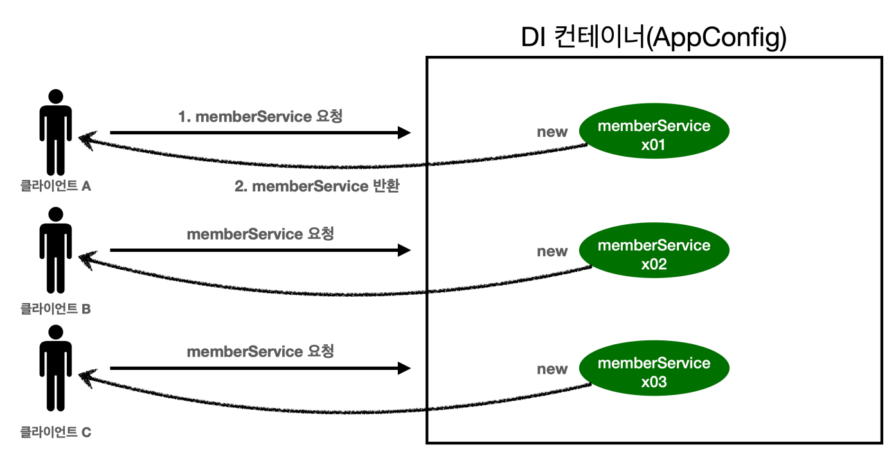
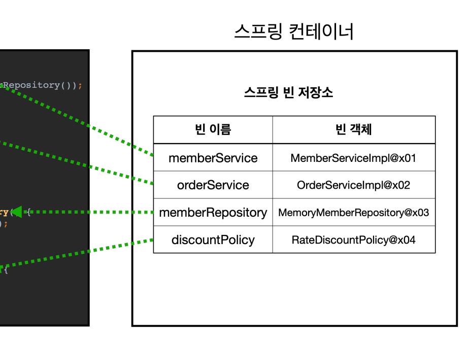
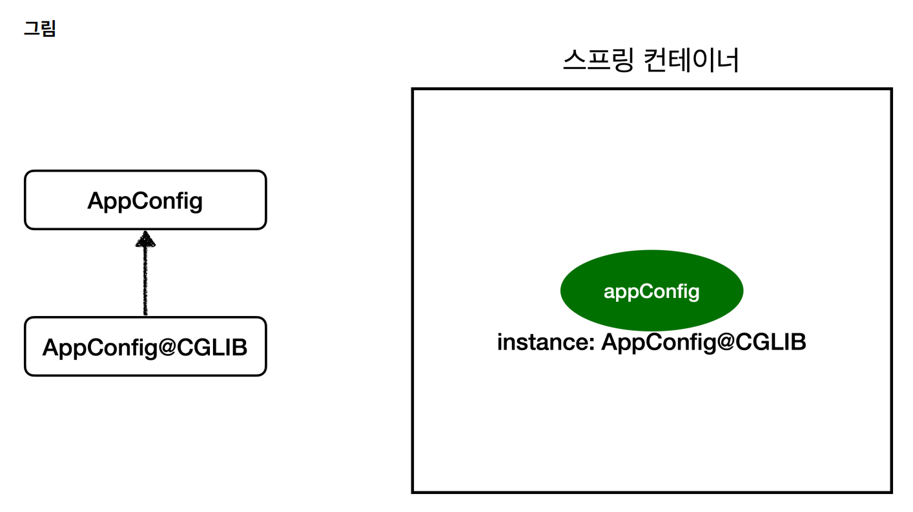

## 스프링 컨테이너 생성


## 싱글톤



유저가 요청할때마다 객체를 하나씩 생성하면 터진다.

하나를 만들어놓고 요청마다 공유할 필요가 있다.

이걸 만족한걸 싱글톤이라고 한다.

```java
public class SingletonService {
    private static final SingletonService instance = new SingletonService();
    
    public static SingletonService getInstance() {
        return instance;
    }
    
    private SingletonService() {
    }
    
    public void logic() {
        System.out.println("싱글톤 객체 로직 호출");
    }
}
```

위 코드는 완벽하게 싱글톤 패턴을 만족하는 하나의 클래스다.

`static`을 통해 코드 구동과 함께 인스턴스가 하나 생성되며, 생성자는 `private`이기 때문에 이후 호출될 일이 없다.

이 인스턴스는 `getInstace()`를 통해서만 참조할 수 있다.

```java
import static org.assertj.core.api.Assertions.*;

public class SingletonTest {
    @Test
    @DisplayName("싱글톤 패턴을 적용한 객체 사용")
    public void singletonServiceTest() {

        //private으로 생성자를 막아두었다. 컴파일 오류가 발생한다.
        //new SingletonService();

        //1. 조회: 호출할 때 마다 같은 객체를 반환
        SingletonService singletonService1 = SingletonService.getInstance();
        //2. 조회: 호출할 때 마다 같은 객체를 반환
        SingletonService singletonService2 = SingletonService.getInstance();
        //참조값이 같은 것을 확인
        System.out.println("singletonService1 = " + singletonService1);
        System.out.println("singletonService2 = " + singletonService2);

        assertThat(singletonService1).isSameAs(singletonService2);
        singletonService1.logic();
    }

}
```

인스턴스 하나로 다 돌려막아지고 있는 것을 확인할 수 있다.

그럼 이 방식으로 기존의 AppConfig, 그리고 클래스들을 수정해야 하는가? 그건 아니다.

스프링 컨테이너는 **기본적으로 싱글톤 패턴을 만족**해준다.

만약 스프링이 자동으로 싱글톤 패턴을 만족시켜주지 않았다면? 위와 같이 수동으로 해줘야 했다면? 다음과 같은 문제들이 발생한다.

### 싱글톤(스프링x)의 문제점

- 싱글톤 패턴을 구현하는 코드 자체가 많이 들어간다.
- 의존관계상 클라이언트가 구체 클래스에 의존한다(`getInstance()` 등을 써야만 한다) - DIP를 위반한다.
- 클라이언트가 구체 클래스에 의존해서 OCP 원칙을 위반할 가능성이 높다.
- 테스트하기 어렵다.
- 내부 속성을 변경하거나 초기화 하기 어렵다. 
- private 생성자로 자식 클래스를 만들기 어렵다.
- 결론적으로 유연성이 떨어진다.
- 안티패턴으로 불리기도 한다.


## 스프링 컨테이너와 싱글톤 컨테이너



이미 예전에 봤던 대로, 스프링 컨테이너는 각 빈들의 인스턴스를 하나씩 생성하고 그 참조값을 테이블에 저장한다. 싱글톤이다.

물론 필요에 따라 인스턴스를 여러개 생성하게 할 수도 있다. 이건 '빈 스코프'라는 개념과 연결된다. 하지만 99.9%의 경우는 다 싱글톤 패턴을 쓴다.


## 싱글톤 방식의 주의점

싱글톤을 쓸 때 꼭 주의해야 할 점이 있다.

여러 클라이언트가 동시에 하나의 인스턴스를 공유하기 때문에, **싱글톤 객체는 상태를 유지(stateful)하게 설계하면 안된다**.

### 무상태(stateless) 조건

- 특정 **클라이언트에 의존적인 필드**가 있으면 안된다.
- 특정 **클라이언트가 값을 변경**할 수 있는 필드가 있으면 안된다.
- 가급적 **읽기만 가능**해야 한다.
- **필드** 대신에 자바에서 공유되지 않는, **지역변수, 파라미터, ThreadLocal** 등을 사용해야 한다.

실무에서 이게 안된 경우가 종종 보인댄다. 이로인해 정말 해결하기 어려운 큰 문제들이 터진댄다.(몇년에 한번씩 꼭 만난댄다.)

**진짜 공유필드는 조심해야 한다.** **스프링 빈은 "항상" 무상태(stateless)**로 설계하자.


## @Configuration과 싱글톤

```java
@Configuration
public class AppConfig {
     @Bean
     public MemberService memberService() {
     	return new MemberServiceImpl(memberRepository());
     }
     @Bean
     public OrderService orderService() {
         return new OrderServiceImpl(
                 memberRepository(),
                 discountPolicy());
     }
     @Bean
     public MemberRepository memberRepository() {
         return new MemoryMemberRepository();
     }
     ...
}
```

memberService 빈을 만드는 코드를 보면 memberRepository() 를 호출한다. 이 메서드를 호출하면 new MemoryMemberRepository() 를 호출한다. 

orderService 빈을 만드는 코드도 동일하게 memberRepository() 를 호출한다. 이 메서드를 호출하면 new MemoryMemberRepository() 를 호출한다. 

결과적으로 **각각 다른 2개의 MemoryMemberRepository 가 생성**되면서 **싱글톤이 깨지는** 것 처럼 보인다. 스프링 컨테이너는 이 문제를 어떻게 해결할까?

이를 확인하기 위해 다음과 같이 AppConfig를 수정하여 로그를 남기게 한다.

```java
@Configuration
public class AppConfig {
    @Bean
    public MemberService memberService() {
        //1번
        System.out.println("call AppConfig.memberService");
        return new MemberServiceImpl(memberRepository());
    }

    @Bean
    public OrderService orderService() {
        //1번
        System.out.println("call AppConfig.orderService");
        return new OrderServiceImpl(
                memberRepository(),
                discountPolicy());
    }

    @Bean
    public MemberRepository memberRepository() {
        //2번? 3번?
        System.out.println("call AppConfig.memberRepository");
        return new MemoryMemberRepository();
    }

    @Bean
    public DiscountPolicy discountPolicy() {
        return new RateDiscountPolicy();
    }
}
```

멤버 리포지토리가 2번 생성되므로 로그는 2번 떠야 한다. 스프링 빈에 등록하는 과정까지 포함하면 사실 3번은 떠야 한다.

그러나 실제로는 로그가 한번만 출력된다. 멤버리포지토리가 한번만 생성됐단거다.


##  @Configuration과 바이트코드 조작

스프링이 자 바 코드까지 어떻게 하기는 어렵다. 위 자바 코드를 보면 분명 3번 호출되어야 하는 것이 맞다.

그래서 스프링은 클래스의 **바이트코드를 조작**하는 라이브러리를 사용한다. 

모든 건 @Configuration 을 적용함으로써 이뤄진다.

```java
@Test
void configurationDeep() {
    ApplicationContext ac = new
            AnnotationConfigApplicationContext(AppConfig.class);
    //AppConfig도 스프링 빈으로 등록된다.
    AppConfig bean = ac.getBean(AppConfig.class);

    System.out.println("bean = " + bean.getClass());
    //출력: bean = class hello.core.AppConfig$$EnhancerBySpringCGLIB$$bd479d70
}
```

위 코드로 다음과 같은 결과가 나온다.

```text
bean = class hello.core.AppConfig$$EnhancerBySpringCGLIB$$bd479d70
```

순수한 클래스라면 다음과 같이 출력되어야 한다. 

```text
bean = class hello.core.AppConfig
```

예상과는 다르게 클래스 명에 xxxCGLIB가 붙으면서 상당히 복잡해진 것을 볼 수 있다.



이것은 내가 만든 클래스가 아니라 스프링이 CGLIB라는 **바이트코드 조작 라이브러리**를 사용해서 **AppConfig 클래스를 상속**받은 임의의 다른 클래스를 만들고, **그 상속받은 클래스를 스프링 빈으로 등록**한 것이다.

AppConfig@CGLIB 예상 코드:

```java
@Bean
public MemberRepository memberRepository() {

    if (memoryMemberRepository가 이미 스프링 컨테이너에 등록되어 있으면 ?){
        return 스프링 컨테이너에서 찾아서 반환;
    } else{ //스프링 컨테이너에 없으면
        기존 로직을 호출해서 MemoryMemberRepository를 생성하고 스프링 컨테이너에 등록
        return 반환
    }
}
```

`@Bean`이 붙은 메서드마다 이미 스프링 빈이 **존재하면 그걸 반환**하고, 없으면 기존 코드대로 **만들어서 등록, 반환**하는 코드가 동적으로 만들어진다.

### @Configuration 을 적용하지 않고, @Bean 만 적용하면?

@Configuration 만 지우고 AppConfig를 사용하면, 아까 전의 테스트에서 다음과 같이 결과가 나온다.

```text
bean = class hello.core.AppConfig
```

상속하는 새 클래스(@CGLIB)가 생성되지 않은 거다.

**싱글톤 규칙도 깨진다**. 멤버 리포지토리가 3번 생성되고, 각기 **다른 인스턴스 3개가 모두 스프링 컨테이너에 존재**하게 된다.

**@Bean만 사용해도 스프링 빈으로 등록되지만, 싱글톤을 보장하지 않는다.**

스프링 설정 정보는 항상 @Configuration 을 사용하자.

