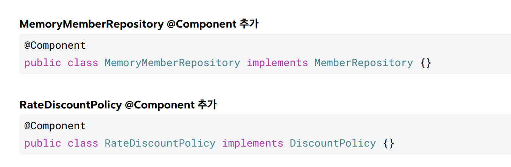
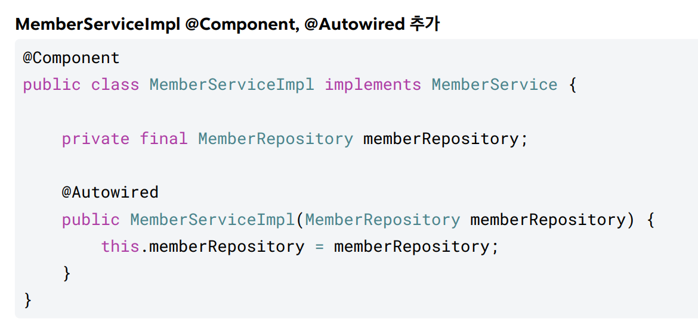
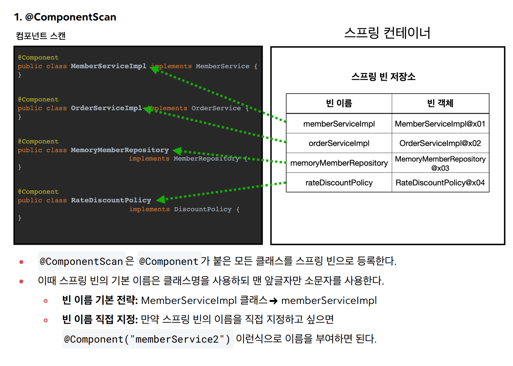
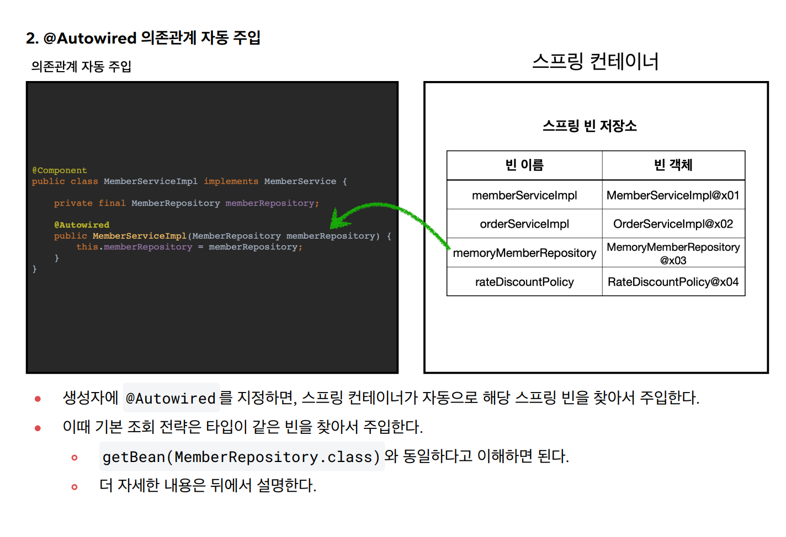
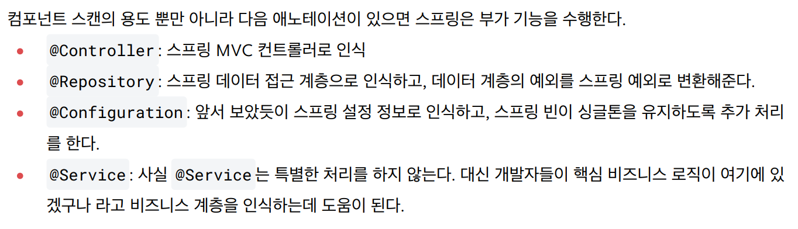
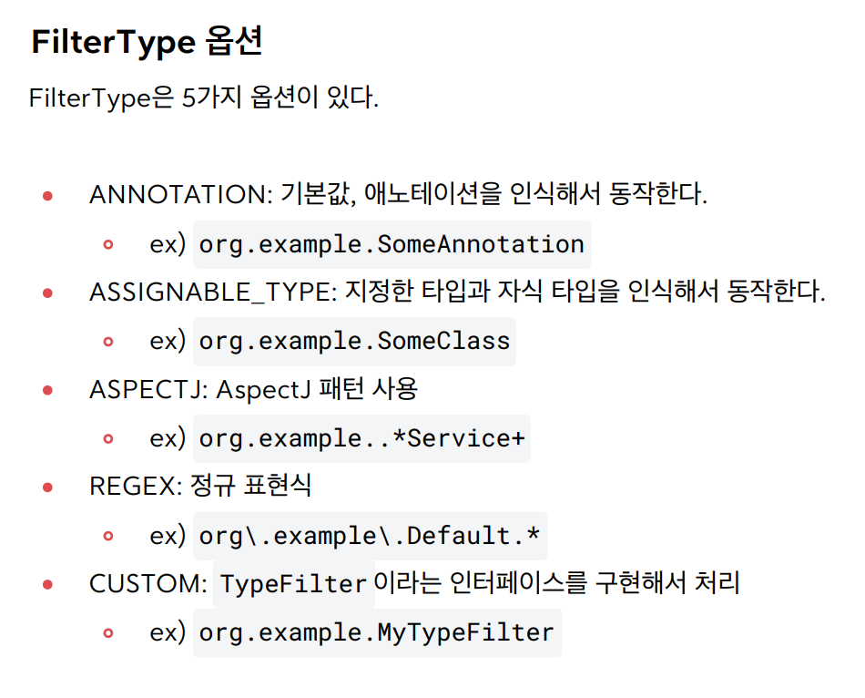

## 스프링 컨테이너 생성


## 컴포넌트 스캔과 의존관계 자동 주입

지금까진 스프링 빈을 등록할 때 직접 설정 정보 파일에 빈들을 나열해야 했다.

근데 실무에선 등록할 빈이 수백개가 돼버리는데, 이거 다 일일이 등록하기도 싫고 꼭 누락해서 문제가 생기기도 한다.

그래서 설정 정보 없이도 자동으로 빈 등록해주는 컴포넌트 스캔이라는 기능이 있다.

또 의존관계도 자동으로 주입하는 @Autowired라는 기능도 있다.

새 방식을 적용하기 위한 새 설정 파일 `AutoAppConfig.java`를 만들자.

```java
@Configuration
@ComponentScan(
        excludeFilters = @Filter(type = FilterType.ANNOTATION, classes =
                Configuration.class))
public class AutoAppConfig {

}
```

주목할 부분은 `@ComponentScan`이다.

`(excludeFilters = @Filter(type = FilterType.**ANNOTATION**, classes = Configuration.*class*))` 이건 기존에 수동으로 등록하는 AppConfig랑 충돌하지 말라는 거다.

AutoAppConfig 내부가 텅 비었다. 지금은 비었지만, 스프링이 싹다 긁어와서 구성해준다.

정확히는, @Component 어노테이션이 붙은 클래스를 스캔해서 스프링 빈으로 등록한다.

@Configuration도 코드를 까보면 **@Component를 포함하는 어노테이션**이다. 따라서 스캔 대상에 포함된다. 이 외에도 @Component를 포함하는 어노테이션이 많이 있다.

이제 각 클래스의 구현부에 직접 가서 @Component를 붙여줘야 한다. 추상화가 아닌 **구현체에 붙여야 한다.**



이런식으로 다 붙여준다.

근데 특이사항이 있다. 기존 AppConfig에서는 **의존성 주입**에 대한 설정 내용도 우리가 직접 명시해줬다.

근데 이걸 자동으로 돌렸으니 추가 설정을 해줘야 한다.

의존성 주입이 필요한 부분에 `@Autowired`를 다음과 같이 붙여줘야 한다.



의존성이 실질적으로 주입되는 생성자 부분에 @Autowired를 붙여준 모습이다.

잘 됐는지 다음 테스트로 알 수 있다.

```java
import static org.assertj.core.api.Assertions.*;
public class AutoAppConfigTest {
    @Test
    void basicScan() {
        ApplicationContext ac = new
                AnnotationConfigApplicationContext(AutoAppConfig.class);
        MemberService memberService = ac.getBean(MemberService.class);
        assertThat(memberService).isInstanceOf(MemberService.class);
    }
}
```

예전에 AppConfig 테스트에서 컨테이너에 주는 설정이 AutoAppConfig로 바뀐 형태다.





타입이 같은 빈을 찾아서 주입한다는 게 중요하다.

- **`getBean(MemoryRepository.class)`와 동일한 동작**


## 탐색 위치와 기본 스캔 대상

자바 클래스를 싹다 스캔하면 시간이 오래 걸린다. 위치 지정이 가능하다.

또한 효율이 목적이 아니어도 스캔하고 싶은 영역만 지정하기 위해서도 사용된다.

```java
@ComponentScan(
 basePackages = "hello.core",
}
```

이렇게 하면 hello.core 패키지를 포함해서 그 하위를 모두 스캔한다.

여러 패키지를 지정하고 싶으면 basePackage = {a, b} 형식으로 지정할 수 있다.

지정하지 않으면, 디폴트로 **해당 설정 파일(@Configuration)이 있는 패키지가 basePackage**가 된다.

**권장하는 방법(김영한):** 개인적으로 즐겨 사용하는 방법은 패키지 위치를 지정하지 않고, 설정 정보 클래스의 위치를 프로젝트 최상단에 두는 것이다. 최근 스프링 부트도 이 방법을 기본으로 제공한다.

사실 **스프링 부트 사용하면 @ComponentScan을 쓸 일이 잘 없다**. @SpringBootApplication에 저게 포함돼있고, 최상위 패키지가 기본 스캔 범위로 들어가는거니까 딱히 만질 게 없어진다.

### 컴포넌트 스캔 기본 대상

- **`@Component`**
- **`@Controller`**
- **`@Service`**
- **`@Repository`**
- **`@Configuration`**

얘네는 다들 내부에 @Component를 포함하고 있다.

- **참고:** 사실 **애노테이션에는 상속관계라는 것이 없다.** 그래서 이렇게 애노테이션이 특정 애노테이션을 들고 있는 것을 인식할 수 있는 것은 자바 언어가 지원하는 기능은 아니고, **스프링이 지원**하는 기능이다.



위는 각 어노테이션의 기능 설명이다.


## 필터

```java
import static org.assertj.core.api.Assertions.assertThat;
import static org.springframework.context.annotation.ComponentScan.Filter;
public class ComponentFilterAppConfigTest {
    @Test
    void filterScan() {
        ApplicationContext ac = new
                AnnotationConfigApplicationContext(ComponentFilterAppConfig.class);
        BeanA beanA = ac.getBean("beanA", BeanA.class);
        assertThat(beanA).isNotNull();
        Assertions.assertThrows(
                NoSuchBeanDefinitionException.class,
                () -> ac.getBean("beanB", BeanB.class));
    }

    @Configuration
    @ComponentScan(
            includeFilters = @Filter(type = FilterType.ANNOTATION, classes =
                    MyIncludeComponent.class),
            excludeFilters = @Filter(type = FilterType.ANNOTATION, classes =
                    MyExcludeComponent.class)
    )
    static class ComponentFilterAppConfig {
    }
}
```

위와 같이 @ComponentScan에서 includeFilters, excludeFilters를 지정해줌으로써 필터를 적용할 수 있다.




## 중복 등록과 충돌

컴포넌트 스캔에서 같은 빈 이름으로 충돌하는 두가지 경우

- 자동 빈 등록 vs 자동 빈 등록
- 자동 빈 등록 vs 수동 빈 등록

### 자동 빈 등록 vs 자동 빈 등록

자동 등록 과정에서 스프링 빈 이름이 같은 경우, **ConflictingBeanDefinitionException 예외**를 발생시킨다.

### 자동 빈 등록 vs 수동 빈 등록

충돌 예시:

```java
@Component
public class MemoryMemberRepository implements MemberRepository {} 
```

```java
@Configuration
@ComponentScan//자동등록
public class AutoAppConfig {
    //수동등록
    @Bean(name = "memoryMemberRepository")
    public MemberRepository memberRepository() {
        return new MemoryMemberRepository();
    }
}
```

이때는 **수동 등록 빈이 우선권을 가진다.**(수동 빈이 자동 빈을 **오버라이딩** 해버린다.)

그런데 **스프링 부트를 사용하면 이 경우에 오류내고 튕겨버린다.** 

왜냐하면 이걸 의도대로 사용하는 경우보다 **꼬이게 만드는 경우가 훨씬 많아서.**

이런걸 활용할 생각 하면 안된다. 역시나 **피해야 할 충돌**인거다.

잘쓰면 잘쓰는게 맞긴 한데, 개발 혼자 하는거 아니니까 명확히 하기 위해 안쓰는게 좋다. 대놓고 오류인게 차라리 나은 오류지, 이렇게 애매하게 발생하는 오류가 잡기 훨씬 어렵고 치명적인 오류인거다. 그래서 스프링부트에서 그냥 막아버린것.