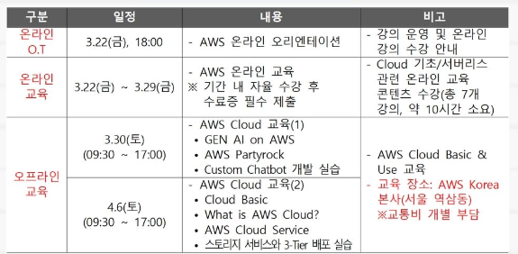
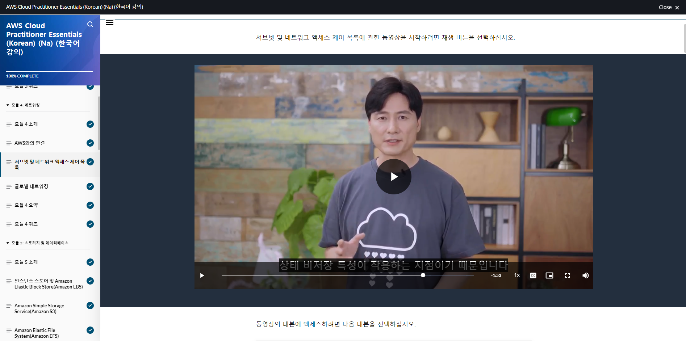

우리학교 SW중심사업단에서 가져온 "AWS Cloud Camp"에 참여했다.

마침 지금 1인 풀스택 프로젝트를 시작했고, 가장 생소하고 진입이 어렵다고 느낀 게 AWS 부분이었기에, 교육을 시켜주겠다고 하니 냅다 달려가서 신청했다.

웬만하면 다른 프로그램들처럼 지원자 모자라서 추가모집을 할 줄 알았는데, 웬일로 신청자가 초과돼서 잘라 받은 듯 하다.

남들에게도 이게 좋은 기회로 보이긴 했나보다.

지원서 열심히 쓰길 잘했다.

## 교육 일정

일정은 위와 같다. 주말 중 토요일에 두 번, AWS 코리아에 가서 오프라인 실습을 하고, 첫 실습 전까지 온라인 교육을 통해 이론을 배운다.

## 온라인 교육 - AWS 스킬 빌더 학습

AWS 스킬 빌더라는 플랫폼에서 온라인 교육 영상을 제공한다.

생각보다 퀄리티가 높아서 놀랐다.

무슨 터미네이터같이 깔끔한 발표자 세 분이서 돌아가며 스피치를 한다.

대본이 완전 번역체고 자꾸 미국식 조크를 친다.

그래도 자체적으로 퀄리티가 높아서 공부하기에 편했다.

내용은 정말 'AWS란 무엇인가?'라는 느낌으로 시작해 어떤 서비스를 제공하는지 설명하는 내용이다.

## 오프라인 교육 - AWS 코리아 본사

역삼역 주변 큰 빌딩에 있는 AWS 코리아 본사에 갔다.

건물이 돈냄새로 점칠된 느낌의 빌딩이었다.

교육 중 과자나 그 외 간식, 커피 등을 푸짐하게 제공해준다.

점심도 사줬는데 빌딩 지하에 자리한 겁나 비싸보이는 식당 메뉴를 제공해준다.

난 등뼈 쌀국수 먹었다.

첫날 오전엔 교육이라기보단 직원분이 요즘 IT 트렌드와 관련하여 이야기 해주시며, 여기저기 뼈도 때려주시는 시간을 가졌다.

AI 이야기를 많이 하셨다.  Canva라는 서비스가 이쪽에선 최고존엄이니 빨리 구독해서 활용해먹으라는 취지의 이야기를 하셨다.

가장 기억에 새겨야겠다고 생각이 든 부분의 사진을 찍었다.

이날 오후부터 둘째날까지는 본격적인 실습을 했다.

AWS의 실습 플랫폼을 사용해서 체계적으로 진행됐다.

동작 하나하나를 구체적으로 지시해줘서 따라가기엔 수월했으나, 역시나 그 많은 옵션들이 각각 뭘 의미하는지는 모르는 채 시키는대로 하게 되는 일이 많았다.

다 설명했다간 아무것도 진행이 안되겠구나 라는게 언뜻 봐도 느껴지는 부분들이었다. 실제 비즈니스에서 쓰는 것들이다보니 복잡할 수 밖에 없을 듯 하다.

그래도 거시적인 관점에서 구성이 어떻게 되고 무슨 일들이 일어나는 지 이해하고 감을 잡는 데에 많은 도움이 되었다.

직접 손대서 굴려봤다는 게 무엇보다 의미가 크지 싶다.

## 후기

AWS 스킬 빌더에서 제공하는 온라인 교육 자료가 생각보다 실용적이었다. 이 뒤에도 필요한 내용이 있을 때 자주 꺼내 활용하게 될 것 같다.

오프라인 실습 역시 체계적으로 진행되어 좋았다. 따로 플랫폼까지 만들어놨으니 말 다했다. 직접 AWS의 서비스를 굴려보는 경험을 한 게 온라인 교육과 연결시키기에도 좋았고, 감을 직접 익히는 데에 좋은 효과를 봤다.

현장에 계신 직원분들한테 공통된 분위기가 있음을 느껴 신기했다. 다들 재치있고 자유롭다고 해야 할까, 거침없는 느낌이다. 미국 기업이라 그런건가? 우연인지 아님 어떤 역학관계가 있는건지 잘 모르겠다. 이런데서 일하면 재밌을 것 같다. 덕분에 교육도 전체적으로 재밌고 지루하지 않았다.

좋은 직장에 가고픈 마음이 더 커졌다. 나도 이렇게 돈내 풀풀나는 건물에 출근하고싶다.

전체적으로 정말 알차고 실용적인 교육을 받았다는 생각이다. 비단 교육 내용뿐만 아니어도, 현장에 들락날락 하는 경험까지도 쉽게 하기 힘든 좋은 경험이었다. 
